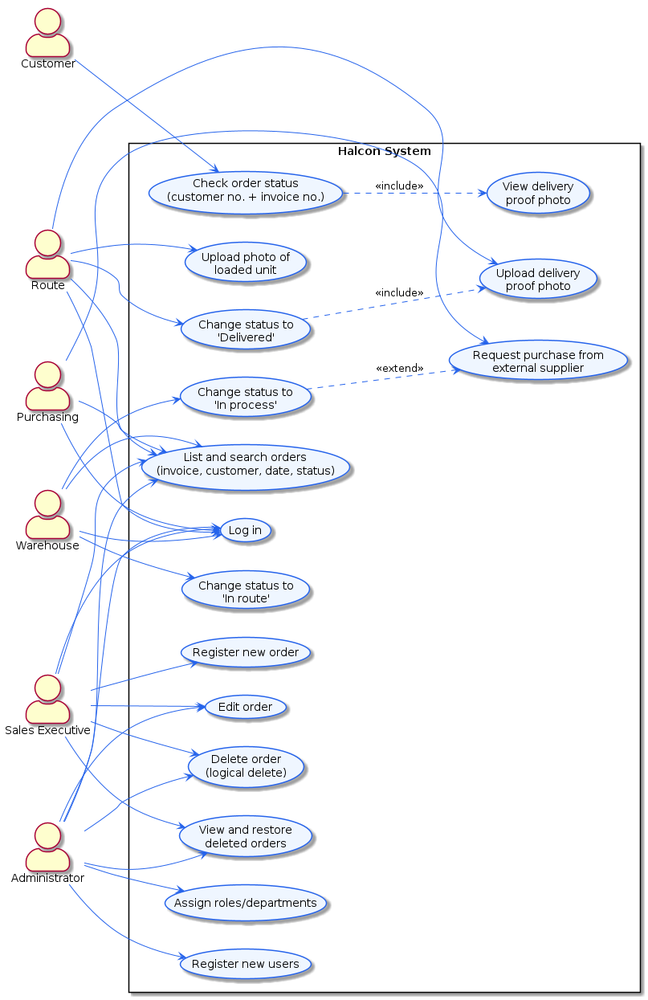
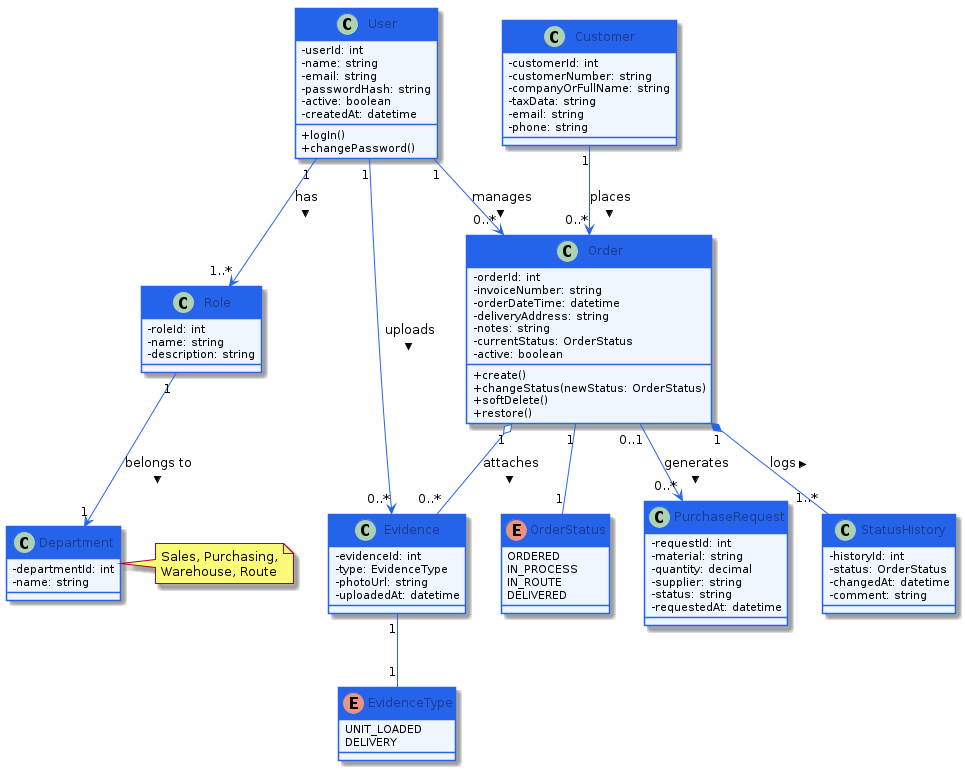
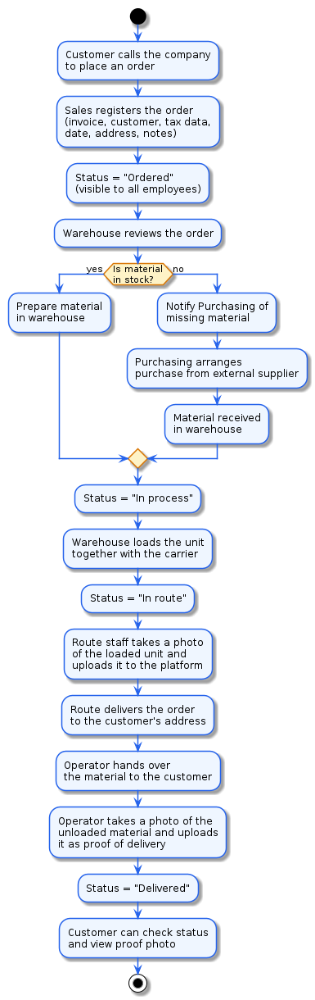

# UML Diagrams

## Use Case Diagram

Models the interaction of the 6 actors (Customer, Sales, Warehouse, Purchasing,
Route, Administrator) with the system's functions, including `<<include>>`
relationships (e.g., delivering includes uploading evidence) and `<<extend>>`
relationships (changing to "In process" may extend to generating a purchase
request).

## Class Diagram

Models the domain entities: `User`, `Role`, `Department`, `Customer`, `Order`,
`StatusHistory`, `Evidence` and `PurchaseRequest`, with their attributes, main
methods and relationship multiplicities.

## Activity Diagram

Models the full order life-cycle flow, from the moment the customer calls to
place an order until it is marked as delivered, including the decision point on
whether material is in stock or must be purchased from an external supplier.
