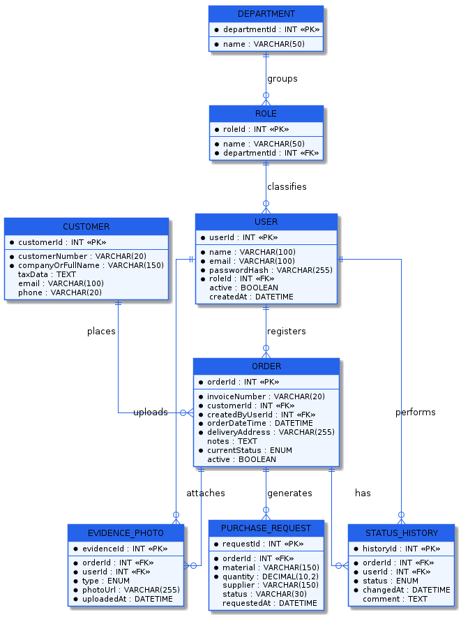

# Database

## Chosen Engine: PostgreSQL (Relational)

### Justification
- The business data is highly **structured and relational**: an order belongs to
  a customer, has a status history, photo evidence and, optionally, purchase
  requests — well-defined 1:N relationships that naturally fit a relational model
  with foreign keys.
- **Strong referential integrity** is required (e.g., a photo evidence record must
  not be created without a valid order, nor an order without a valid customer).
- Natively supports `ENUM` types (useful for the order status field) and ACID
  transactions, important for not losing or duplicating status changes.
- It is open source, with excellent support in Node.js/Django/Laravel and good
  performance for the workload of an internal system of this size (equivalent
  alternative: MySQL/MariaDB).

## Entity-Relationship Diagram

### Main Entities
| Entity | Purpose |
|---|---|
| `USER` | Employees who access the administrative dashboard. |
| `ROLE` | Role assigned to a user (linked to a department). |
| `DEPARTMENT` | Sales, Purchasing, Warehouse, Route. |
| `CUSTOMER` | Customers who place orders. |
| `ORDER` | Order with invoice number, delivery data and current status. |
| `STATUS_HISTORY` | Log of every status change for an order. |
| `EVIDENCE_PHOTO` | Loading and delivery photos, linked to an order. |
| `PURCHASE_REQUEST` | Purchase request to an external supplier when material is missing. |

Logical deletion of an order is implemented with an `active` flag on `ORDER`,
instead of a physical `DELETE`, allowing it to be viewed and later restored from
the "deleted orders" screen.
